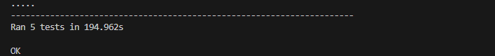
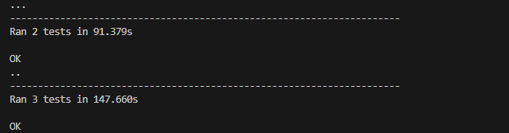
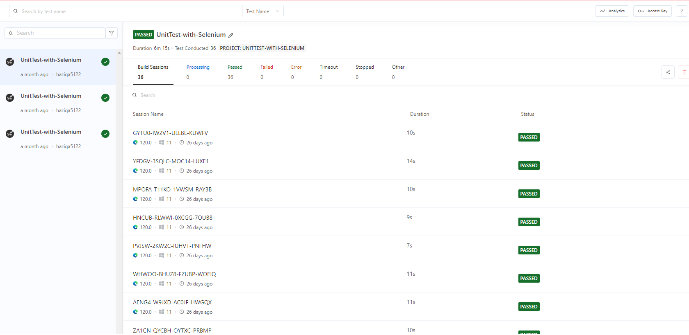
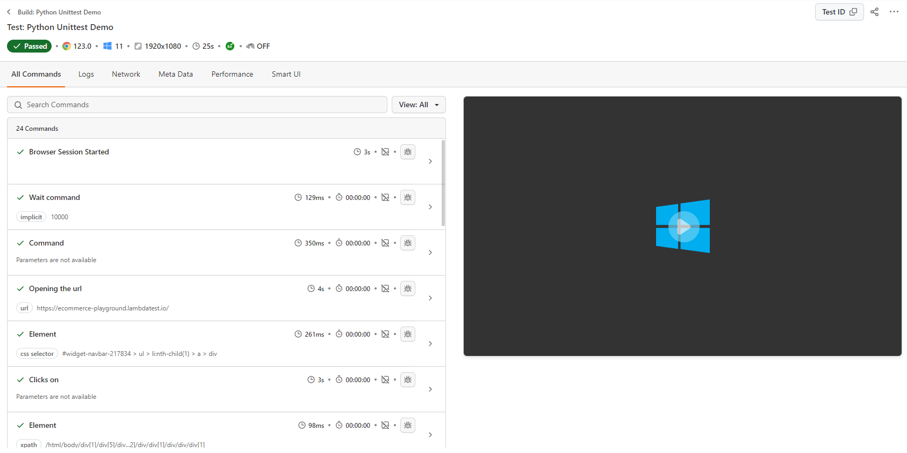

# Unit Testing in Python with unittest and Selenium

This repository demonstrates automted web testing using `Selenium` and `unittest`.

## Setup
**Step 1**: Install Dependencies

``` bash
pip install -r requirements.txt
```

**Step 2**: Setup LambdaTest credentials.
    
Create a `lambdatest.env` inside tests directory and enter your username and ACCESS_KEY in the following format.

```
LT_USERNAME=<your_user_name>
LT_ACCESS_KEY=<your_access_key>
```

## Run Tests
All tests are defined in the `unittest_with_selenium.py` file. Run all tests using the following command. 
```bash
python -m unittest unittest_with_selenium.py
```



Displayed above is the result of a successful run on the terminal
## Run Tests in Parallel
In order to run the tests in parallel, the following command will be required.
```bash
python parallel_runner.py
```



Displayed above is the result of a successful run on the terminal

## Monitoring on LambdaTest
The test are configured to be executed using the [LambdaTest](https://www.lambdatest.com/) platform. You can monitor all the tests on the dashboard.


After running the above commands, all the tests will be present on the lambdaTest as shown below:



We can select one of the tests and see the events run on them as shown below. 




