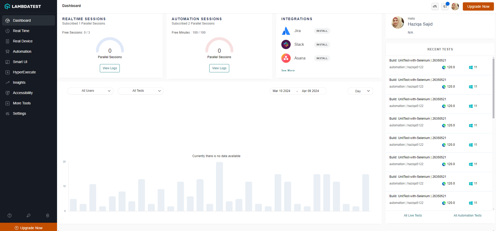

# Unit Testing in Python with unittest and Selenium

This repository demonstrates automted web testing using `Selenium` and `unittest`.

## Setup
**Step 1**: Install Dependencies

``` bash
pip install -r requirements.txt
```

**Step 2**: Setup LambdaTest credentials.
    
Create a `lambdatest.env` and enter your username and ACCESS_KEY in the following format.

```
USER=<your_user_name>
ACCESS_KEY=<your_access_key>
```

## Run Tests
All tests are defined in the `unitest_with_selenium.py` file. Run all tests using the following command.

```bash
python -m unittest unitest_with_selenium.py
```

## Monitoring on LambdaTest
The test are configured to be executed using the [LambdaTest](https://www.lambdatest.com/) platform. You can monitor all the tests on the dashboard.



